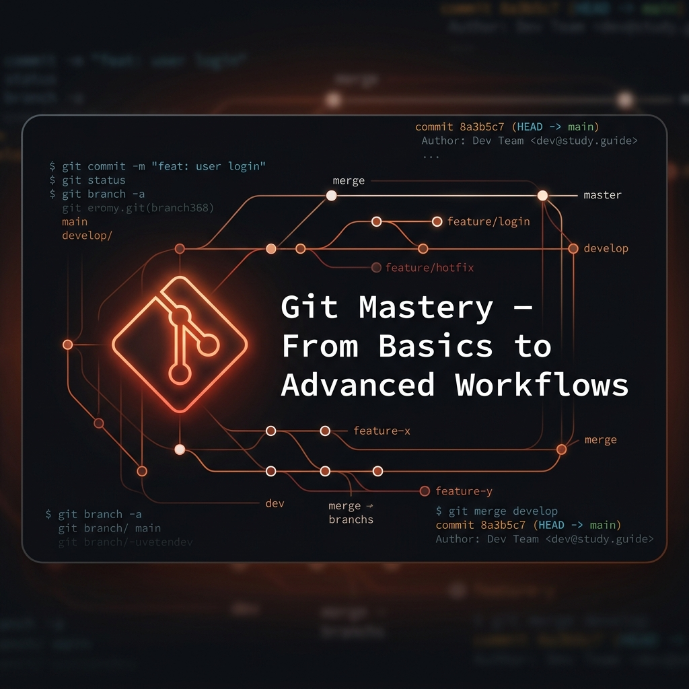

# Git Mastery - From Basics to Advanced Workflows



Welcome to the **Git Mastery Study Guide** - a comprehensive, hands-on reference for developers, DevOps engineers, and anyone looking to master version control. Inspired by real-world development workflows and professional best practices.

## Table of Contents

1. [Module 01: Getting Started](#module-01)
    - [What is Git?](#module-01-what)
    - [Installation & Configuration](#module-01-config)
    - [Git Architecture: The Three Trees](#module-01-arch)
    - [Foundation Cementing: Your First Repo](#module-01-foundation)
2. [Module 02: Git Basics](#module-02)
    - [Tracking Changes: Add & Commit](#module-02-tracking)
    - [Checking Status & History](#module-02-status)
    - [Comparing Changes: Diff](#module-02-diff)
    - [Foundation Cementing: The Basic Workflow](#module-02-foundation)
3. [Module 03: Branching](#module-03)
    - [Why Branch?](#module-03-why)
    - [Creating & Switching Branches](#module-03-create)
    - [Managing Branches](#module-03-manage)
    - [Foundation Cementing: Feature Branching](#module-03-foundation)
4. [Module 04: Merging & Rebasing](#module-04)
    - [Merging: Fast-Forward vs 3-Way](#module-04-merge)
    - [Rebasing: Keeping History Clean](#module-04-rebase)
    - [Resolving Conflicts](#module-04-conflicts)
    - [Foundation Cementing: Integrating Changes](#module-04-foundation)
5. [Module 05: Stashing & Cleaning](#module-05)
    - [Stashing: Saving Work in Progress](#module-05-stash)
    - [Cleaning: Removing Untracked Files](#module-05-clean)
    - [Foundation Cementing: Context Switching](#module-05-foundation)
6. [Module 06: Git Diff](#module-06)
7. [Module 07: Undoing](#module-07)
8. [Module 08: Merging](#module-08)
9. [Module 09: Submodules](#module-09)
10. [Module 10: Committing](#module-10)
11. [Module 11: Aliases](#module-11)
12. [Module 12: Rebasing](#module-12)
13. [Module 13: Configuration](#module-13)
14. [Module 14: Branching](#module-14)
15. [Module 15: Rev-List](#module-15)
16. [Module 16: Squashing](#module-16)
17. [Module 17: Cherry Picking](#module-17)
18. [Appendix A: Top Git Interview Q&A](#appendix-a)
19. [Appendix B: Git Commands Cheatsheet](#appendix-b)

---

<a name="module-01"></a>
## Module 01 - Getting Started
*Phase: Foundations*

Git is a **Distributed Version Control System (DVCS)** created by Linus Torvalds in 2005 for Linux kernel development. Unlike older systems (SVN), every developer has a full copy of the repository history on their machine.

> [!NOTE]
> **Design Philosophy**: Git is built around **snapshots**, not differences. Every time you commit, Git takes a picture of what all your files look like at that moment and stores a reference to that snapshot.

<a name="module-01-config"></a>
### Installation & Configuration

Before you start, you must identify yourself to Git. These settings are stored in `~/.gitconfig`.

```bash
# Set your identity
git config --global user.name "John Doe"
git config --global user.email "john@example.com"

# Set your favorite editor
git config --global core.editor "code --wait"

# Check your settings
git config --list
```

<a name="module-01-arch"></a>
### Git Architecture: The Three Trees

Understanding Git's internal state is the key to mastering it. A Git project consists of three "trees":

| Tree | Description |
| :--- | :--- |
| **1. Working Directory** | The actual files you see and edit on your disk. |
| **2. Staging Area (Index)** | A file that stores information about what will go into your next commit. |
| **3. Repository (HEAD)** | The database of all your committed snapshots. |

**The Workflow:**
1. You modify files in your **Working Directory**.
2. You **Stage** the changes you want to include in your next snapshot (`git add`).
3. You **Commit**, which takes the files as they are in the staging area and stores that snapshot permanently to your **Repository** (`git commit`).

<a name="module-01-foundation"></a>
### Foundation Cementing: Your First Repo

```bash
# 1. Create a directory
mkdir my-project && cd my-project

# 2. Initialize Git
git init

# 3. Create a file
echo "# My Project" > README.md

# 4. Check status
git status
```

---

<a name="module-02"></a>
## Module 02 - Git Basics
*Phase: Foundations*

<a name="module-02-tracking"></a>
### Tracking Changes: Add & Commit

```bash
# Stage a specific file
git add README.md

# Stage all changes (including deletions)
git add .

# Commit with a message
git commit -m "Initial commit"

# Skip staging (only for tracked files)
git commit -a -m "Quick update"
```

> [!TIP]
> **Write Good Commit Messages**: A good commit message follows this pattern:
> `feat: add user login functionality`
> `fix: resolve crash on null sensor reading`
> The first word is the "type", followed by a concise summary in the imperative mood.

<a name="module-02-status"></a>
### Checking Status & History

```bash
# See what is staged, unstaged, and untracked
git status

# See commit history
git log

# See a pretty, one-line graph
git log --oneline --graph --decorate --all
```

<a name="module-02-diff"></a>
### Comparing Changes: Diff

```bash
# Compare Working Directory vs Staging Area
git diff

# Compare Staging Area vs Last Commit
git diff --staged

# Compare two commits
git diff <commit1> <commit2>
```

<a name="module-02-foundation"></a>
### Foundation Cementing: The Basic Workflow

```bash
# Edit a file
echo "New line" >> README.md

# See the difference
git diff

# Stage and commit
git add README.md
git commit -m "docs: update readme with new line"

# Verify in log
git log -n 1
```

---

<a name="module-03"></a>
## Module 03 - Branching
*Phase: Workflow*

Branches are pointers to specific commits. They allow you to diverge from the main line of development and continue to do work without messing with that main line.

<a name="module-03-create"></a>
### Creating & Switching Branches

```bash
# Create a new branch
git branch feature-login

# Switch to a branch
git checkout feature-login
# OR (modern Git)
git switch feature-login

# Create and switch in one command
git checkout -b feature-logout
# OR (modern Git)
git switch -c feature-logout
```

<a name="module-03-manage"></a>
### Managing Branches

```bash
# List all local branches
git branch

# List all branches (local + remote)
git branch -a

# Delete a branch (merged)
git branch -d feature-login

# Force delete a branch (unmerged)
git branch -D feature-failed-experiment
```

<a name="module-03-foundation"></a>
### Foundation Cementing: Feature Branching

```bash
# Start a new feature
git switch -c feat-sensor-driver

# Make some changes
touch sensor.c
git add sensor.c
git commit -m "feat: add basic sensor driver"

# Switch back to main
git switch main
```

---

<a name="module-04"></a>
## Module 04 - Merging & Rebasing
*Phase: Workflow*

Once you've finished work on a branch, you need to bring those changes back into your main line.

<a name="module-04-merge"></a>
### Merging: Fast-Forward vs 3-Way

**Fast-Forward Merge:** Happens when the destination branch has no new commits since you branched off. Git just moves the pointer forward.

**3-Way Merge:** Happens when both branches have diverged. Git creates a new "merge commit" that has two parents.

```bash
# Merge feature into main
git switch main
git merge feat-sensor-driver
```

<a name="module-04-rebase"></a>
### Rebasing: Keeping History Clean

Rebasing takes all the changes that were committed on one branch and "replays" them on another.

```bash
git switch feat-sensor-driver
git rebase main
```

> [!WARNING]
> **The Golden Rule of Rebasing**: Never rebase branches that have been pushed to a public repository. It rewrites history and will break things for your teammates.

<a name="module-04-conflicts"></a>
### Resolving Conflicts

Conflicts happen when Git can't automatically merge changes (e.g., the same line was modified in both branches).

1. Git stops the merge and marks the files as conflicted.
2. You open the files and look for `<<<<<<<`, `=======`, and `>>>>>>>`.
3. You edit the file to resolve the conflict.
4. `git add <file>` to mark it as resolved.
5. `git commit` to finish the merge.

<a name="module-04-foundation"></a>
### Foundation Cementing: Integrating Changes

```bash
# Simulate a conflict
git switch main
echo "Main change" > conflict.txt
git add conflict.txt && git commit -m "main change"

git switch -c feat-conflict
echo "Feature change" > conflict.txt
git add conflict.txt && git commit -m "feature change"

git switch main
git merge feat-conflict
# CONFLICT! Edit conflict.txt, then:
git add conflict.txt
git commit -m "merge: resolve conflict in conflict.txt"
```

---

<a name="module-05"></a>
## Module 05 - Stashing & Cleaning
*Phase: Utility*

<a name="module-05-stash"></a>
### Stashing: Saving Work in Progress

Stashing takes your uncommitted changes (both staged and unstaged) and saves them on a stack for later use.

```bash
# Save changes to stash
git stash

# Save with a message
git stash save "WIP: sensor calibration"

# List stashes
git stash list

# Apply the most recent stash and keep it in the list
git stash apply

# Apply and remove from the list
git stash pop

# Drop a specific stash
git stash drop stash@{0}
```

<a name="module-05-clean"></a>
### Cleaning: Removing Untracked Files

```bash
# See what would be deleted
git clean -n

# Actually delete untracked files
git clean -f

# Delete untracked directories as well
git clean -fd
```

<a name="module-05-foundation"></a>
### Foundation Cementing: Context Switching

```bash
# You're working on a feature but need to fix a bug on main
git status # Uncommitted changes
git stash
git switch main
# ... fix bug ...
git switch feat-x
git stash pop
```

---

<a name="module-06"></a>
## Module 06 - Git Diff
*Phase: Inspection*

`git diff` helps you compare file states across the Working Directory, Staging Area, commits, and branches.

<a name="module-06-working"></a>
### Working Directory vs Staging Area

```bash
# Show unstaged changes
git diff

# Show staged changes
git diff --staged
```

<a name="module-06-compare"></a>
### Compare Commits, Branches, and Paths

```bash
# Compare two commits
git diff <commit1> <commit2>

# Compare branches
git diff main..feature-x

# Compare current branch with another branch tip
git diff feature-x

# Diff only one file or directory
git diff -- src/main.c
git diff main..feature-x -- include/
```

<a name="module-06-advanced"></a>
### Useful Diff Options

```bash
# Show both staged and unstaged changes against HEAD
git diff HEAD

# Word-level diff for long lines / prose
git diff --word-diff

# Output patch-compatible diff
git diff -p
```

> [!TIP]
> Use `git diff --staged` before every commit to verify exactly what will be recorded in history.

---

<a name="module-07"></a>
## Module 07 - Undoing
*Phase: Recovery*

Undo operations depend on whether changes are uncommitted, staged, committed locally, or already shared remotely.

<a name="module-07-unstage"></a>
### Unstage and Discard Local Changes

```bash
# Unstage a file (keep edits in working directory)
git reset HEAD README.md

# Discard changes in working directory (modern)
git restore README.md

# Discard all local uncommitted changes
git reset --hard
```

<a name="module-07-commits"></a>
### Undo Commits Safely

```bash
# Move branch back one commit, keep changes staged
git reset --soft HEAD~1

# Move branch back one commit, unstage changes
git reset --mixed HEAD~1

# Revert a commit by creating a new opposite commit (safe on shared branches)
git revert <commit_hash>
```

<a name="module-07-reflog"></a>
### Recover Mistakes with Reflog

```bash
# Show recent HEAD movements
git reflog

# Recover branch to a known good state
git reset --hard <reflog_hash>
```

---

<a name="module-08"></a>
## Module 08 - Merging
*Phase: Integration*

Merging combines histories from different branches. Git can auto-merge or stop for manual conflict resolution.

<a name="module-08-basic"></a>
### Basic Merge Operations

```bash
# Merge feature branch into current branch
git switch main
git merge feature-login

# Force a merge commit even when fast-forward is possible
git merge --no-ff feature-login
```

<a name="module-08-conflicts"></a>
### Conflicts, Abort, and "Ours/Theirs"

```bash
# Abort an in-progress merge
git merge --abort

# Keep current branch version during conflict for one file
git checkout --ours config.yml

# Keep incoming branch version during conflict for one file
git checkout --theirs config.yml

# Mark as resolved
git add config.yml
git commit
```

<a name="module-08-check"></a>
### Check Merge Status

```bash
# See merged branches
git branch --merged

# See not-yet-merged branches
git branch --no-merged
```

---

<a name="module-09"></a>
## Module 09 - Submodules
*Phase: Dependency Management*

Submodules let one repository track a specific commit of another repository.

<a name="module-09-add"></a>
### Add, Clone, and Init Submodules

```bash
# Add submodule
git submodule add https://github.com/user/lib.git external/lib

# Clone including submodules
git clone --recursive https://github.com/user/project.git

# Initialize submodules in an existing clone
git submodule update --init --recursive
```

<a name="module-09-update"></a>
### Update and Track Branches

```bash
# Pull latest submodule commits from recorded pointers
git submodule update --recursive

# Let a submodule track a branch
git config -f .gitmodules submodule.external/lib.branch main
git submodule update --remote
```

<a name="module-09-remove"></a>
### Remove a Submodule

```bash
git submodule deinit -f external/lib
git rm -f external/lib
rm -rf .git/modules/external/lib
```

---

<a name="module-10"></a>
## Module 10 - Committing
*Phase: Core Workflow*

Commits are snapshots with metadata (author, date, message, parent commit) and should be atomic and meaningful.

<a name="module-10-basic"></a>
### Stage and Commit Patterns

```bash
# Commit staged changes
git add .
git commit -m "feat: add uart parser"

# Commit tracked file changes directly
git commit -a -m "fix: handle null packet"

# Commit only specific files
git commit src/main.c include/main.h -m "refactor: split parser api"
```

<a name="module-10-amend"></a>
### Amend, Empty, and Authorship

```bash
# Amend latest commit
git commit --amend -m "feat: add uart parser and tests"

# Create an empty commit (useful for CI triggers)
git commit --allow-empty -m "chore: trigger pipeline"

# Commit as another author
git commit --author="Jane Doe <jane@example.com>" -m "docs: update guide"
```

<a name="module-10-sign"></a>
### Signed and Dated Commits

```bash
# GPG-sign commit
git commit -S -m "security: sign release preparation"

# Commit with explicit date
GIT_AUTHOR_DATE="2026-04-27T10:00:00" \
GIT_COMMITTER_DATE="2026-04-27T10:00:00" \
git commit -m "chore: backfill historical commit"
```

---

<a name="module-11"></a>
## Module 11 - Aliases
*Phase: Productivity*

Aliases reduce repetitive typing and encode team-standard command patterns.

<a name="module-11-simple"></a>
### Simple Aliases

```bash
git config --global alias.st status
git config --global alias.co checkout
git config --global alias.br branch
git config --global alias.cm "commit -m"
```

<a name="module-11-advanced"></a>
### Advanced Aliases

```bash
# Pretty graph log
git config --global alias.lg "log --oneline --graph --decorate --all"

# Show ignored files
git config --global alias.ignored "ls-files -v | grep '^[[:lower:]]'"

# Update current branch with linear history
git config --global alias.up "pull --rebase --autostash"
```

```bash
# List aliases
git config --get-regexp ^alias\\.
```

---

<a name="module-12"></a>
## Module 12 - Rebasing
*Phase: History Hygiene*

Rebasing replays commits on top of another base commit, producing a cleaner linear history.

<a name="module-12-local"></a>
### Local Branch Rebasing

```bash
# Rebase your feature branch on latest main
git switch feature-x
git fetch origin
git rebase origin/main
```

<a name="module-12-interactive"></a>
### Interactive Rebase

```bash
# Rewrite last 4 commits
git rebase -i HEAD~4
```

Common actions:
- `pick`: keep commit
- `reword`: edit message
- `edit`: stop and amend commit
- `squash` / `fixup`: combine commits
- `drop`: remove commit

<a name="module-12-safe"></a>
### Abort, Continue, and Push After Rebase

```bash
# If conflicts occur
git status
# resolve conflicts...
git add <resolved_files>
git rebase --continue

# Stop and return to pre-rebase state
git rebase --abort

# Push rewritten history safely
git push --force-with-lease
```

---

<a name="module-13"></a>
## Module 13 - Configuration
*Phase: Setup & Environment*

Git configuration can be scoped at system, global, and repository levels.

<a name="module-13-levels"></a>
### Config Scopes and Inspection

```bash
# List effective configuration
git config --list

# Edit global config
git config --global --edit

# Set local repo-only values
git config user.name "Project Specific Name"
git config user.email "project@example.com"
```

<a name="module-13-editor"></a>
### Editor, Autocorrect, Line Endings, Proxy

```bash
# Set default editor
git config --global core.editor "code --wait"

# Autocorrect mistyped commands after delay (tenths of a second)
git config --global help.autocorrect 10

# Line endings (cross-platform team setup)
git config --global core.autocrlf input

# Configure proxy
git config --global http.proxy http://proxy.example.com:8080
```

<a name="module-13-once"></a>
### One-Time Config for Single Command

```bash
git -c user.name="Temp User" -c user.email="temp@example.com" commit -m "hotfix"
```

---

<a name="module-14"></a>
## Module 14 - Branching
*Phase: Workflow*

Branches are movable pointers to commits, enabling parallel development.

<a name="module-14-create"></a>
### Create, List, Switch, Rename

```bash
# Create branch
git branch feature-auth

# Create and switch
git switch -c feature-auth

# List branches
git branch
git branch -a

# Rename current branch
git branch -m feat/auth-flow
```

<a name="module-14-remote"></a>
### Tracking and Remote Branch Management

```bash
# Track remote branch
git switch --track origin/feature-auth

# Push and set upstream
git push -u origin feature-auth

# Delete remote branch
git push origin --delete feature-auth
```

<a name="module-14-delete"></a>
### Delete and Special Branch Types

```bash
# Delete merged local branch
git branch -d feature-auth

# Force delete unmerged branch
git branch -D spike-temp

# Create orphan branch (no parent history)
git switch --orphan gh-pages
```

---

<a name="module-15"></a>
## Module 15 - Rev-List
*Phase: Inspection*

`git rev-list` is a low-level command for enumerating commits in reverse chronological order with fine control.

<a name="module-15-ranges"></a>
### Commit Range Queries

```bash
# Commits in local main but not in origin/main
git rev-list origin/main..main

# Commits in branch-a but not branch-b
git rev-list branch-b..branch-a
```

<a name="module-15-count"></a>
### Count and Filter

```bash
# Count ahead commits
git rev-list --count origin/main..main

# Show only merge commits in range
git rev-list --merges main..feature-x
```

---

<a name="module-16"></a>
## Module 16 - Squashing
*Phase: History Cleanup*

Squashing combines multiple commits into one, improving readability before sharing or merging.

<a name="module-16-rebase"></a>
### Squash with Interactive Rebase

```bash
# Squash the latest 3 commits
git rebase -i HEAD~3
```

In the editor:
- Keep first commit as `pick`
- Change next commits to `squash` or `fixup`
- Save and combine commit messages as needed

<a name="module-16-merge"></a>
### Squash During Merge

```bash
# On main, squash-merge a feature branch
git switch main
git merge --squash feature-ui
git commit -m "feat: add complete ui feature set"
```

<a name="module-16-fixup"></a>
### Autosquash with Fixup Commits

```bash
# Create fixup commit targeted to an older commit
git commit --fixup <target_commit>

# Rebase with autosquash enabled
git rebase -i --autosquash HEAD~5
```

---

<a name="module-17"></a>
## Module 17 - Cherry Picking
*Phase: Selective Integration*

Cherry-pick applies specific commit(s) from one branch onto another without merging full branch history.

<a name="module-17-single"></a>
### Pick Single or Multiple Commits

```bash
# Pick one commit
git cherry-pick <commit_hash>

# Pick a range (inclusive start, exclusive end style with ^)
git cherry-pick <oldest_commit>^..<newest_commit>
```

<a name="module-17-workflow"></a>
### Conflict Handling During Cherry-Pick

```bash
# If conflict occurs
git status
# resolve files...
git add <resolved_files>
git cherry-pick --continue

# Abort if needed
git cherry-pick --abort
```

<a name="module-17-check"></a>
### Check if Cherry-Pick Is Needed

```bash
# Show commits in feature-x not yet in main
git log main..feature-x --oneline

# Equivalent patch-id comparison helper
git cherry -v main feature-x
```

---

<a name="appendix-a"></a>
## Appendix A - Top Git Interview Q&A

**Q1. What is the difference between `git pull` and `git fetch`?**
- `git fetch`: Downloads changes from remote but doesn't merge them.
- `git pull`: Downloads changes AND merges them into your current branch (`fetch` + `merge`).

**Q2. What is a "detached HEAD"?**
It happens when you checkout a specific commit instead of a branch. You are no longer on a branch. To fix, switch back to a branch: `git switch main`.

**Q3. What is the difference between `git reset` and `git revert`?**
- `reset`: Moves the branch pointer back in time (rewrites history).
- `revert`: Creates a new commit that undoes the changes (safe for shared branches).

**Q4. How do you resolve a merge conflict?**
Edit the conflicted files to choose the desired code, `git add` the files, and `git commit`.

**Q5. What is `git stash`?**
It temporarily shelves (stashes) changes you've made to your working copy so you can work on something else, and then come back and re-apply them later.

---

<a name="appendix-b"></a>
## Appendix B - Git Commands Cheatsheet

| Category | Command | Description |
| :--- | :--- | :--- |
| **Setup** | `git init` | Initialize a local repo |
| | `git clone <url>` | Clone a remote repo |
| **Basics** | `git add <file>` | Stage changes |
| | `git commit -m "msg"` | Commit changes |
| | `git status` | Check status |
| | `git log` | See history |
| **Branching** | `git branch <name>` | Create branch |
| | `git switch <name>` | Switch branch |
| | `git merge <name>` | Merge branch |
| **Remotes** | `git remote add <name> <url>` | Add remote |
| | `git push <remote> <branch>` | Push changes |
| | `git pull <remote> <branch>` | Pull changes |
| **Undoing** | `git reset --hard <hash>` | Wipe changes |
| | `git revert <hash>` | Undo commit safely |
| | `git stash` | Save WIP changes |

---

*This guide was created to help developers master Git. It is designed to be a living reference.*

*Modeled after: [Robotics C++ Notes](https://github.com/arjunskumar/Robotics_CPP_Notes)*

